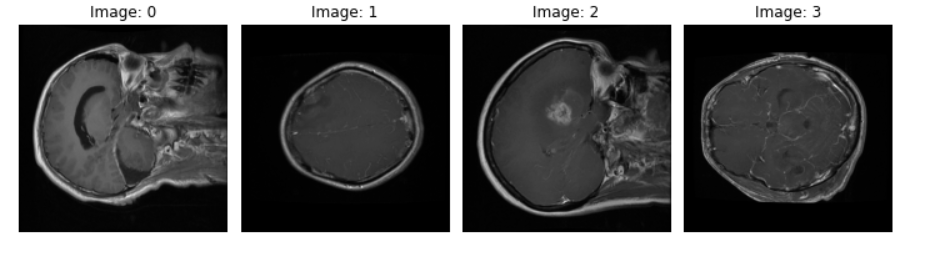
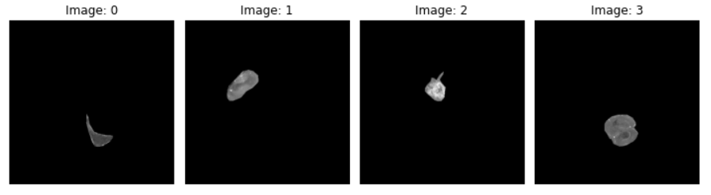
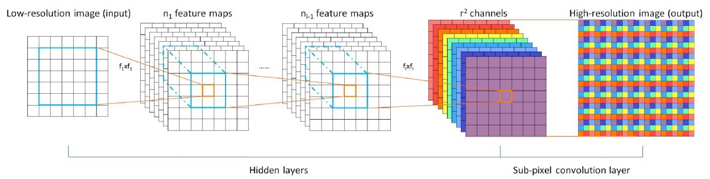

# ESPCN for Brain-Tumor MRI Super-Resolution

This experiment applies the Efficient Sub-Pixel Convolutional Neural Network (ESPCN) from [Real-Time Single Image and Video Super-Resolution Using an Efficient Sub-Pixel Convolutional Neural Network](https://arxiv.org/abs/1609.05158) to brain-tumor MRI.

## Dataset

The experiment uses the [figshare brain-tumor dataset](https://figshare.com/articles/dataset/brain_tumor_dataset/1512427), which provides T1-weighted contrast-enhanced images, tumor labels, patient IDs, manually delineated borders, and tumor masks. The masks allow image quality to be analyzed specifically within pathological regions.

## Architecture

The implementation extracts low-resolution feature maps with convolutional layers and uses a final sub-pixel convolution (`depth_to_space`) to increase spatial resolution. The experiment adds an extra convolutional layer to the standard three-layer ESPCN design.

## Experiment artifacts

- [`img/ESPCN Flow.png`](img/ESPCN%20Flow.png) shows the experiment flow.
- [`img/espcn_output.png`](img/espcn_output.png) and [`img/final_result.png`](img/final_result.png) contain output examples.
- The remaining images record input, prediction, model, and loss visualizations.

The training notebook used to create these artifacts is not present in this directory. The images and notes therefore document the historical experiment but are not, by themselves, a reproducible implementation.
