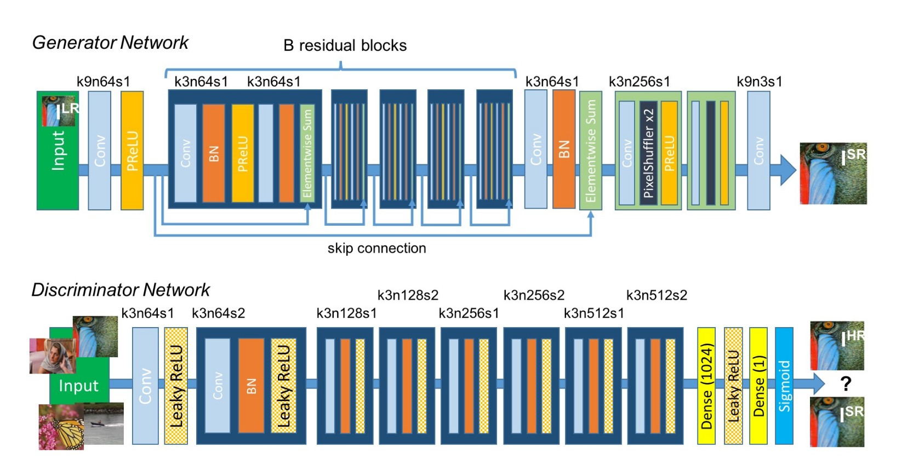
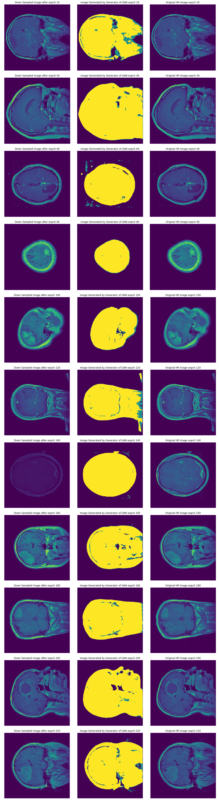
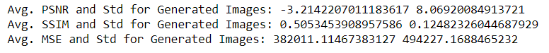

# SRGAN for Brain-Tumor MRI Super-Resolution

This experiment adapts [Photo-Realistic Single Image Super-Resolution Using a Generative Adversarial Network](https://arxiv.org/abs/1609.04802) to brain-tumor MRI.

High-resolution `512 × 512` images are blurred and downsampled to `128 × 128`. The generator reconstructs `512 × 512` images, while the discriminator learns to distinguish generated images from the original high-resolution images.

## Dataset

The experiment uses the [figshare brain-tumor dataset](https://figshare.com/articles/dataset/brain_tumor_dataset/1512427). It includes T1-weighted contrast-enhanced images, class labels, patient IDs, tumor borders, and tumor masks used for region-specific evaluation.

## Architecture

The generator uses residual connections, PReLU activations, and pixel-shuffle upsampling. The discriminator uses convolutional blocks with LeakyReLU activations followed by dense classification layers.

## Contents

- [`implementing-srgan-on-brain-tumor-data.ipynb`](implementing-srgan-on-brain-tumor-data.ipynb) and its 5,000-iteration variant contain notebook experiments.
- [`srgan script/`](srgan%20script/) contains the network definition and training script.
- [`img/`](img/) contains the architecture, workflow, generated output, loss, MSE, PSNR, and SSIM figures.

## Reproduction notes

The notebooks and scripts are historical research code with unpinned dependencies and dataset-specific paths. Reproduction requires obtaining the dataset, updating local paths, and installing the TensorFlow/Keras and imaging-library versions expected by the selected implementation. GPU execution is recommended for training.

